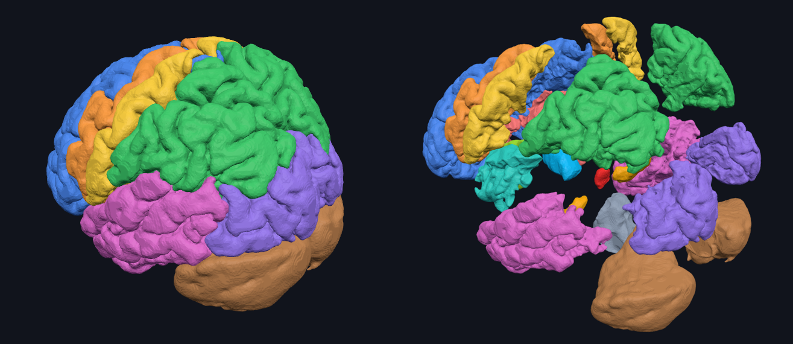

# פאזל מוח להדפסה בתלת־ממד

הקובץ `brain-puzzle-stl.zip` מכיל **28 חלקים** (סט אחד). כדי להכין 3 סטים מדפיסים את כל הקבצים 3 פעמים.
כל קובץ הוא גוף אחד סגור ("watertight"), ובין חלקים שנוגעים זה בזה נשאר מרווח של כחצי מילימטר, כדי שאחרי ההדפסה הם ייכנסו זה לזה.

## גודל וחומר

| | |
|---|---|
| גודל המוח המורכב | כ־12 ס"מ אורך (70% מגודל אמיתי) |
| חומר לסט (PLA, מילוי 15%) | בערך 300 גרם כולל תמיכות, כלומר גליל של 1 ק"ג לשלושה סטים |
| הקטנה | אפשר להקטין בתוכנת הפריסה (Slicer) ל־80% מהגודל שבקבצים; מתחת לזה האמיגדלה נעשית זעירה (פחות מ־1 ס"מ) |

## הגדרות הדפסה מומלצות

- גובה שכבה 0.2 מ"מ, 2–3 קירות, מילוי 10–15%.
- **תמיכות: כן** – עדיף "עץ" / Organic. הצורות מעוגלות ולכמעט לכל חלק יש בליטות.
- **Brim** לחלקים הקטנים (אמיגדלה, היפוקמפוס, גוף מסוייד) כדי שלא יתנתקו מהמשטח.
- החלקים שמורים במיקום שלהם בתוך המוח. אחרי הטעינה ל־Slicer לוחצים **Arrange** (מקש A ב־PrusaSlicer / Bambu / Cura) כדי לפרוס אותם על המשטח, ומסובבים כל חלק כך שהצד השטוח־יחסית (הצד הפנימי) יהיה למטה.

## החלקים והצבעים (כמו באתר)

| קובץ | חלק | צבע באתר |
|---|---|---|
| `frontal_L/R` | האונה המצחית | כחול |
| `motor_L/R` | קליפת המוח המוטורית | כתום |
| `sensory_L/R` | קליפת המוח החושית | צהוב |
| `parietal_L/R` | האונה הקודקודית | ירוק |
| `temporal_L/R` | האונה הרקתית | ורוד |
| `occipital_L/R` | האונה העורפית | סגול |
| `cingulate_L/R` | הפיתול החגורתי | אדום־ורדרד |
| `insula_L/R` | האינסולה | טורקיז |
| `amygdala_L/R` | האמיגדלה | אדום |
| `hippocampus_L/R` | ההיפוקמפוס | כתום־זהב |
| `thalamus_L/R` | התלמוס | תכלת |
| `basalganglia_L/R` | גרעיני הבסיס | ירוק בהיר |
| `cerebellum_L/R` | המוח הקטן | חום |
| `brainstem` | גזע המוח | אפור |
| `corpuscallosum` | הגוף המסוייד | לבן |

`_L` = חצי המוח השמאלי, `_R` = הימני. אם אין מדפסת רב־צבעית, אפשר להדפיס כל חלק בגליל בצבע שלו, או להדפיס הכול בלבן ולצבוע.
חדרי המוח לא מודפסים – הם נשארים חללים ריקים בתוך המוח, בדיוק כמו במציאות (הם מלאים בנוזל).

## סדר הרכבה מומלץ

1. גזע המוח, ואחריו שני חצאי המוח הקטן מאחוריו.
2. התלמוס משני צידי ראש גזע המוח, וגרעיני הבסיס לצידו.
3. ההיפוקמפוס והאמיגדלה (מתחת ולפני התלמוס).
4. הגוף המסוייד – הגשר שמעל, בין שני החצאים.
5. האינסולה, ואחריה הפיתול החגורתי בצד הפנימי.
6. האונות מבחוץ: רקתית ← מצחית ← מוטורית ← חושית ← קודקודית ← עורפית.

החלקים לא ננעלים זה בזה. כדי שהמוח המורכב יחזיק, אפשר להשתמש ב"פלסטלינה דביקה" (Blu Tack) קטנה בין החלקים, או להרכיב כל חצי מוח בשכיבה על השולחן.

## רישיון

המודל מבוסס על Brain for Blender של Anderson M. Winkler (brainder.org), מבוסס FreeSurfer, ברישיון
[CC BY-SA 3.0](https://creativecommons.org/licenses/by-sa/3.0/). קבצי ההדפסה הם עבודה נגזרת ומשותפים באותו רישיון.
הסקריפט שמייצר אותם: `tools/print_stl.py`.
